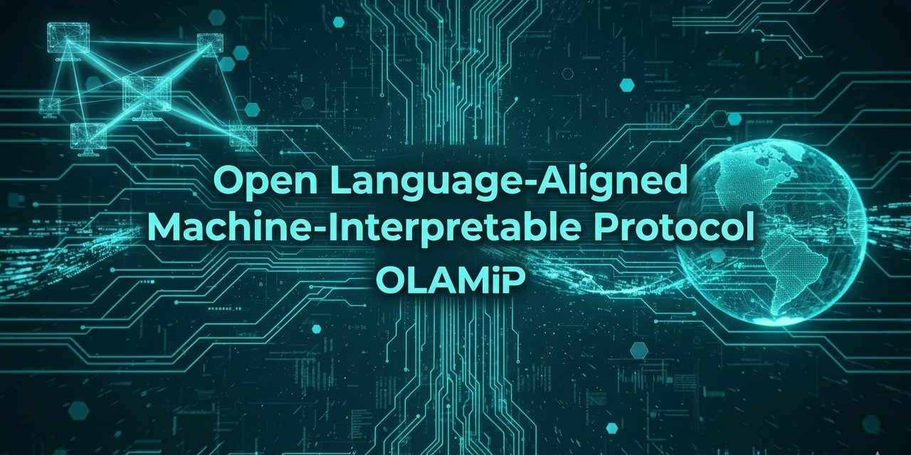

<p align="center">
  
</p>

<p align="center">
  
</p>

<h1 align="center">OLAMIP Protocol</h1>

<p align="center">
  <strong>Open Language‑Aligned Machine‑Interpretable Protocol</strong><br>
  A multilingual, structured, machine‑interpretable standard for AI‑readable websites.
</p>

<p align="center">
  <a href="https://olamip.org/">Website</a> •
  <a href="https://olamip.org/file-format-specification/">File Format Spec</a> •
  <a href="https://olamip.org/delta-updates/">OLAMIP‑DELTA</a> •
  <a href="https://olamip.org/frequently-asked-questions/">FAQ</a>
</p>

---

# 📘 Overview

OLAMIP is an open, multilingual protocol that enables websites to describe their structure, meaning, and intent in a **machine‑interpretable** format.  
It provides a clean JSON‑based representation that large language models (LLMs) can parse reliably — without scraping or interpreting HTML, CSS, or JavaScript.

This repository contains:

- The **official OLAMIP specification**
- The **OLAMIP‑DELTA incremental update protocol**
- Multilingual documentation and governance materials
- Examples and templates

---

# 🌐 Language Index

OLAMIP documentation is available in multiple languages.  
Each category (Specs, Docs, Governance) contains parallel folders:

```
/specs/<lang>
/docs/<lang>
/governance/<lang>
```

### Supported Languages

| Language | Code | Specs | Docs | Governance |
|---------|------|-------|------|------------|
| English | en | [/specs/en](specs/en/) | [/docs/en](docs/en/) | [/governance/en](governance/en/) |
| Spanish | es | [/specs/es](specs/es/) | [/docs/es](docs/es/) | [/governance/es](governance/es/) |
| Russian | ru | [/specs/ru](specs/ru/) | [/docs/ru](docs/ru/) | [/governance/ru](governance/ru/) |
| Japanese | ja | [/specs/ja](specs/ja/) | [/docs/ja](docs/ja/) | [/governance/ja](governance/ja/) |
| Chinese (Simplified) | zh‑CN | [/specs/zh-CN](specs/zh-CN/) | [/docs/zh-CN](docs/zh-CN/) | [/governance/zh-CN](governance/zh-CN/) |
| Portuguese | pt | [/specs/pt](specs/pt/) | [/docs/pt](docs/pt/) | [/governance/pt](governance/pt/) |
| Hindi | hi | [/specs/hi](specs/hi/) | [/docs/hi](docs/hi/) | [/governance/hi](governance/hi/) |
| Bengali | bn | [/specs/bn](specs/bn/) | [/docs/bn](docs/bn/) | [/governance/bn](governance/bn/) |

> More languages are added regularly.

---

# 📑 Repository Structure

```
/README.md              → Main repo homepage
/CHANGELOG.md           → Global changelog
/LICENSE                → License
/assets/                → Logos, banners, diagrams

/specs/                 → Official OLAMIP & OLAMIP‑DELTA specifications
    /en/ /es/ /ru/ /ja/ /zh-CN/ /pt/ /hi/ /bn/

/docs/                  → Documentation, guides, explanations
    /en/ /es/ /ru/ /ja/ /zh-CN/ /pt/ /hi/ /bn/

/governance/            → Governance, versioning, processes
    /en/ /es/ /ru/ /ja/ /zh-CN/ /pt/ /hi/ /bn/

/examples/              → Example OLAMIP files and templates
```

---

# 📜 Specifications

### **Core Specification**
- English: [/specs/en](specs/en/)  
- Website version: https://olamip.org/file-format-specification/

### **OLAMIP‑DELTA**
- English: [/specs/en](specs/en/)  
- Website version: https://olamip.org/delta-updates/

---

# 🧭 Governance

Governance, versioning, and protocol evolution:

- English: [/governance/en](governance/en/)
- Hindi: [/governance/hi](governance/hi/)
- Bengali: [/governance/bn](governance/bn/)
- All languages: [/governance](governance/)

---

# 🧪 Examples

Example OLAMIP files and templates:

- [/examples](examples/)

Includes:

- Example `olamip.json`
- Example `olamip-delta.json`
- Section/entry templates
- Best‑practice patterns

---

# 📄 License

This project is released under an open license.  
See the `/LICENSE` file and the `/governance` folder for details.

---

<p align="center">
  <strong>OLAMIP — Making the Web Machine‑Interpretable.</strong><br>
  https://olamip.org/
</p>


